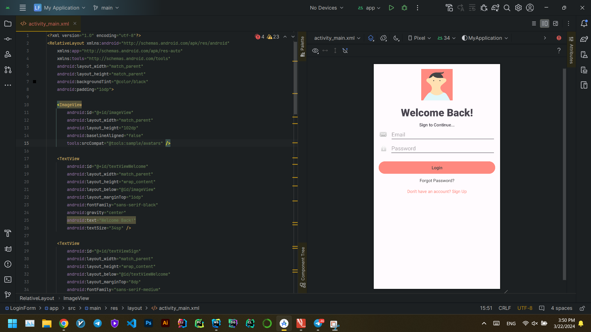
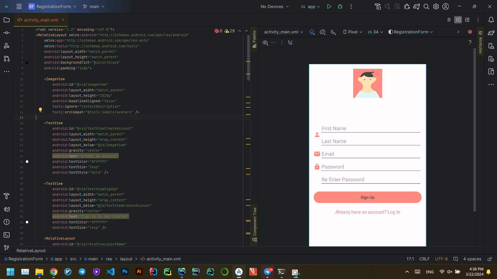
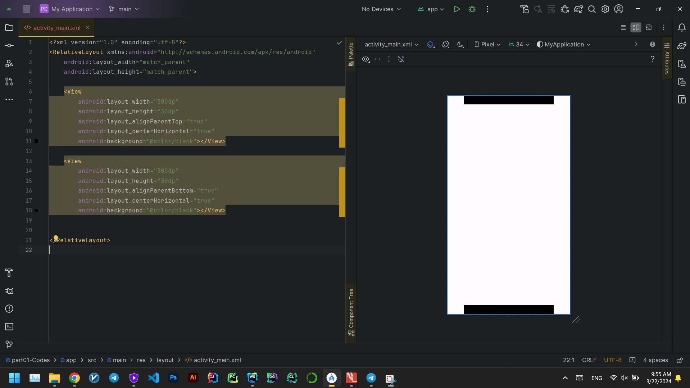
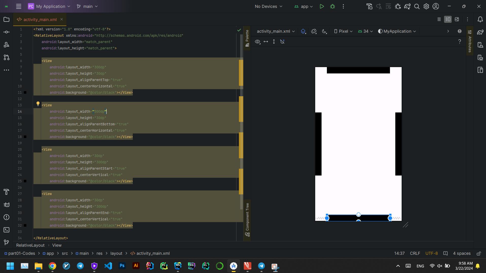
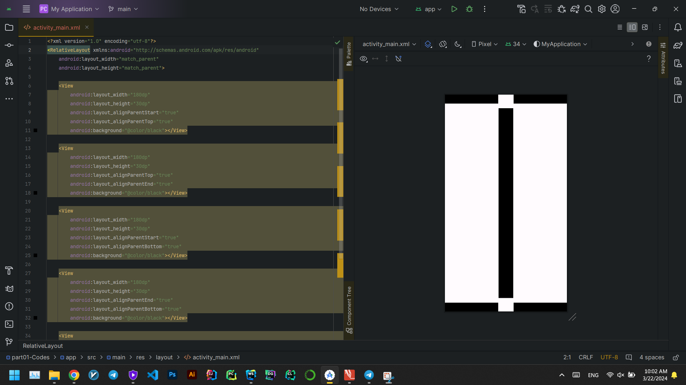
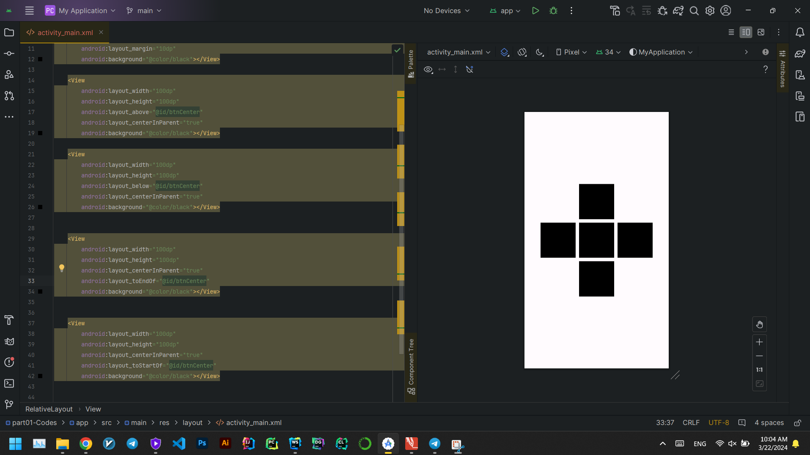
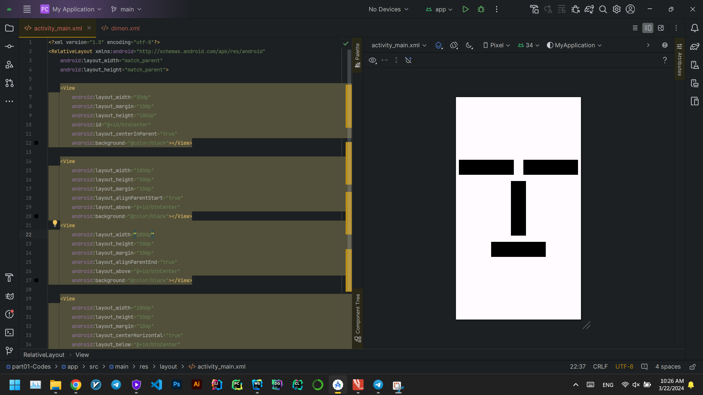

# Assignment04 - Question01
This question refers to four programs created using **RelativeLayout XML** and the **Kotlin** language.

1. [LoginForm](./LoginForm)
   <br>
   

2. [SimpleCalculator](SimpleCalculator)
   <br>
   

3. [RegistrationForm](RegistrationForm)
   <br>
   

4. [SimpleDesigns](SimpleDesigns)
   <br>
   <br><br>
   <br><br>
   <br><br>
   <br><br>
   <br><br>
   


## XML Codes

```
```
