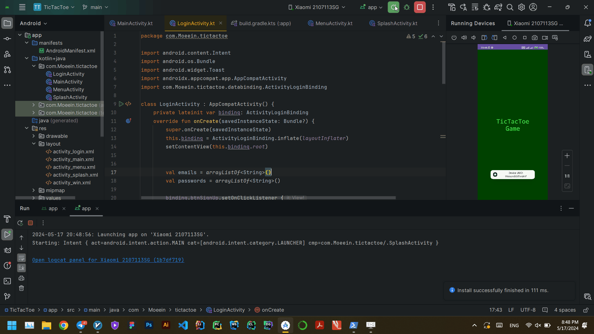

# Tic-Tac-Toe Game

Welcome to the Tic-Tac-Toe game built with Kotlin and XML! This project is an Android application that provides a fun and interactive Tic-Tac-Toe game experience.

## Table of Contents

  - [Table of Contents](#table-of-contents)
  - [Introduction](#introduction)
  - [Features](#features)
  - [Screens](#screens)
    - [Splash Screen](#splash-screen)
    - [Login Activity](#login-activity)
    - [Menu Activity](#menu-activity)
    - [Main Activity](#main-activity)
    - [Win Dialog](#win-dialog)
  - [Usage](#usage)
  - [Contributing](#contributing)

## Introduction

This is a simple yet engaging Tic-Tac-Toe game developed using Kotlin for the logic and XML for the UI. The game includes several activities such as main, menu, login, splash screen, and a win dialog to enhance the user experience.

## Features

- **Splash Screen**: A welcoming screen displayed at the start.
- **Login Activity**: Allows users to log in before playing the game.
- **Menu Activity**: Provides options to start a new game, view settings, or exit.
- **Main Activity**: The core Tic-Tac-Toe gameplay screen.
- **Win Dialog**: A dialog that pops up to announce the winner.

## Screens

### Splash Screen

Displays the game logo and name, and transitions to the login screen.

### Login Activity

Enables users to log in with their credentials to access the game.

### Menu Activity

Offers options to start a new game, adjust settings, or exit the app.

### Main Activity

The main gameplay screen where users can play Tic-Tac-Toe.

### Win Dialog

A popup dialog that announces the winner of the game.

## Usage

1. Launch the app to see the splash screen.
2. Log in using the login activity.
3. Navigate through the menu to start a new game.
4. Play Tic-Tac-Toe in the main activity.
5. The win dialog will appear to announce the winner at the end of the game.

## Contributing

Contributions are welcome! Please fork the repository and create a pull request with your changes. Ensure that your code follows the existing code style and includes appropriate tests.

1. Fork the Project
2. Create your Feature Branch (`git checkout -b feature/AmazingFeature`)
3. Commit your Changes (`git commit -m 'Add some AmazingFeature'`)
4. Push to the Branch (`git push origin feature/AmazingFeature`)
5. Open a Pull Request
